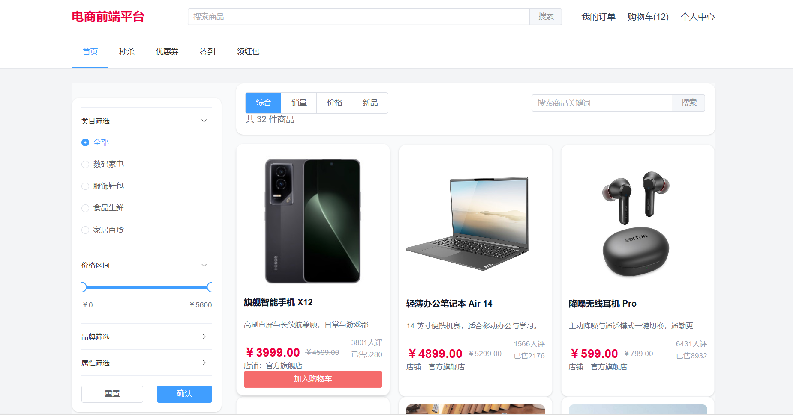
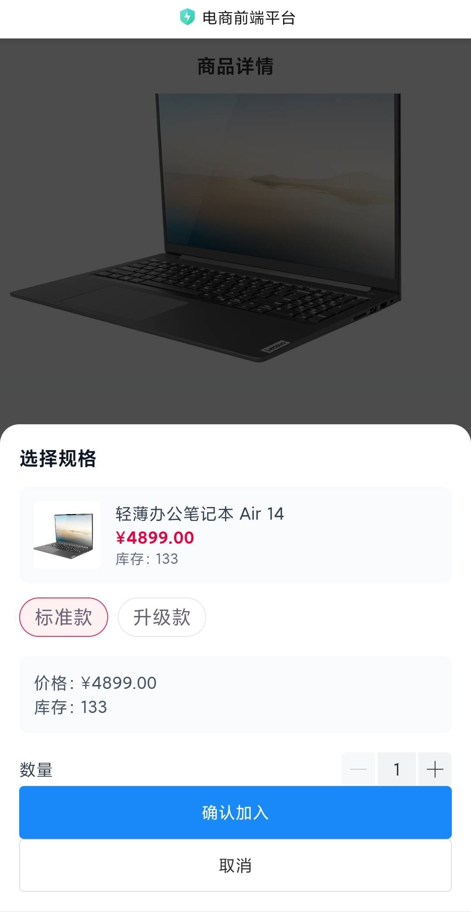
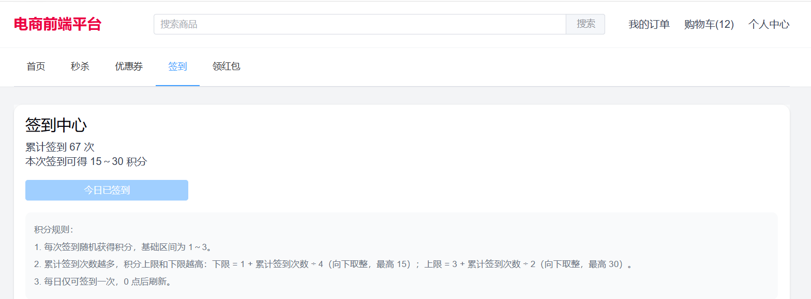
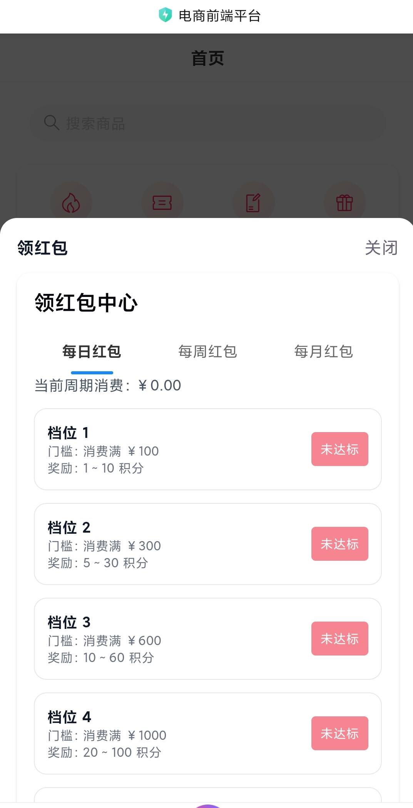
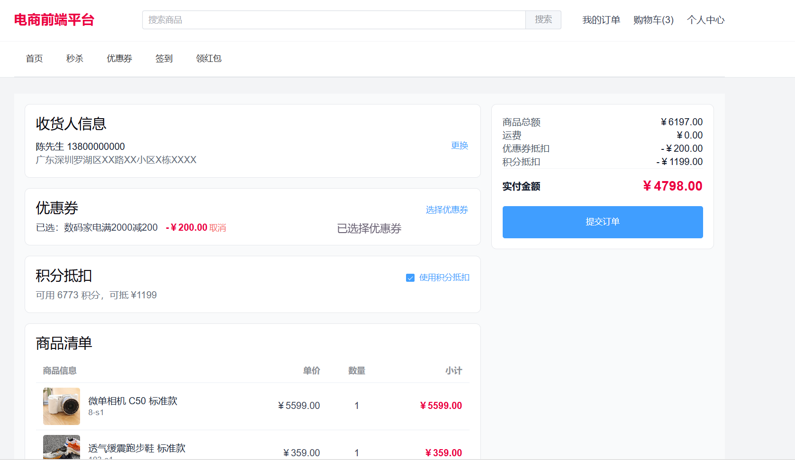

<div align="center">

# Vue 3 企业级电商前端平台

<p>
  <strong>面向企业级业务场景的 Vue 3 电商前端平台</strong><br />
  一套代码覆盖 PC 与移动端，包含商品、交易、营销、积分与工程化体系。
</p>

<p>
  <a href="https://shields.io/"></a>
  <a href="https://shields.io/"></a>
  <a href="https://shields.io/"></a>
  <a href="https://shields.io/"></a>
  <a href="https://shields.io/"></a>
  <a href="https://shields.io/"></a>
  <a href="https://shields.io/"></a>
  <a href="https://shields.io/"></a>
</p>

</div>

## 📌 简介

这是一个基于 `Vue 3 + TypeScript + Vite` 构建的企业级电商前端平台示例项目，围绕“商品浏览 -> 购物车 -> 订单结算 -> 营销活动 -> 用户成长体系”构建完整业务闭环。  
项目采用 **Feature-Sliced Design（FSD）** 分层架构，并通过 `useMediaQuery` 动态切换 PC 与移动端布局，适合作为前端工程化、架构设计与复杂业务实现的综合展示项目。

## ✨ 特性

- 商品体系完整：商品列表、详情、搜索、分类、筛选、排序、SKU 选择
- 交易链路闭环：购物车、确认订单、地址选择、订单列表、订单详情、状态流转
- 营销能力丰富：秒杀、优惠券、签到、领红包、积分体系
- 双端体验统一：PC 使用 Element Plus，移动端使用 Vant
- 状态边界清晰：Vue Query 管理服务端状态，Pinia 管理客户端业务状态
- 本地持久化：用户、订单、购物车、优惠券、地址等核心状态支持本地保留
- Mock 友好：支持本地 mock 数据与接口模块化封装，便于后续切换真实后端
- 工程化完善：ESLint、Prettier、Husky、lint-staged、Commitlint、Cursor Rules

## 🖥️ 界面预览

<!-- 以下为 GitHub 首页展示预留区，建议后续将截图上传到仓库 `docs/assets/` 或图床后替换。-->

### PC 端首页

<!-- 请将图片放到 docs/assets/pc-home.png，尺寸建议 1200x800 -->


### 移动端商品详情页

<!-- 请将图片放到 docs/assets/mobile-product-detail.png，尺寸建议 390x844 -->


### 营销活动面板

<!-- 请将图片放到 docs/assets/pc-signin-panel.png 和 docs/assets/mobile-redpacket-popup.png -->
<!-- 建议左侧放 PC 端面板截图，右侧放移动端弹层截图 -->

| PC 端签到面板 | 移动端领红包弹层 |
| --- | --- |
|  |  |

### 订单结算与优惠券

<!-- 请将图片放到 docs/assets/checkout-coupon.png，尺寸建议 1200x800 -->


## 🚀 快速开始

### 前置条件

- Node.js `>= 18`
- npm

### 安装依赖

```bash
npm install
```

### 启动开发环境

```bash
npm run dev
```

### 构建生产包

```bash
npm run build
```

### 预览生产构建

```bash
npm run preview
```

### 环境变量

在项目根目录创建 `.env.local`：

```env
VITE_API_BASE_URL=/api
```

> 当前项目已验证 `npm run build` 可正常执行。  
> 开发环境下若默认端口被占用，Vite 会自动切换到下一个可用端口。

## 📁 项目结构

项目基于 FSD 思路组织代码，核心结构如下：

```text
src/
├─ app/                 # 应用入口、路由、全局 store 装配
├─ entities/            # 领域模型与类型定义（product/order/cart/coupon/address...）
├─ features/            # 可复用业务能力（product/coupon/seckill/signin/redpacket/user）
├─ pages/               # 路由页面（products/cart/order/user/search/login...）
├─ shared/              # 通用 API、组件、常量、mock 数据、工具
├─ stores/              # Pinia 状态仓库（user/cart/order/coupon/address/app）
├─ widgets/             # 复合布局组件（PcLayout/MobileLayout/AppLayout）
├─ App.vue              # 双端布局切换入口
└─ main.ts              # 应用启动入口
```

## 🧰 技术栈

### 核心依赖

| 技术 | 版本 | 说明 |
| --- | --- | --- |
| Vue | `^3.5.32` | 前端视图框架 |
| TypeScript | `~6.0.2` | 类型系统 |
| Vite | `^8.0.4` | 构建与开发服务器 |
| Vue Router | `^5.0.4` | 路由管理 |
| Pinia | `^3.0.4` | 客户端状态管理 |
| pinia-plugin-persistedstate | `^4.7.1` | 本地持久化 |
| @tanstack/vue-query | `^5.99.0` | 服务端状态管理与缓存 |
| Axios | `^1.15.0` | HTTP 请求层 |
| Element Plus | `^2.13.7` | PC 端组件库 |
| Vant | `^4.9.24` | 移动端组件库 |
| Tailwind CSS | `^4.2.2` | 原子化样式体系 |
| @vueuse/core | `^14.2.1` | 组合式工具库 |

### 工程化工具

| 工具 | 版本 | 说明 |
| --- | --- | --- |
| ESLint | `^9.39.4` | 代码质量检查 |
| Prettier | `^3.8.2` | 代码格式化 |
| Husky | `^9.1.7` | Git Hooks |
| lint-staged | `^16.4.0` | 暂存区增量校验 |
| Commitlint | `^20.5.0` | Conventional Commits 校验 |
| unplugin-auto-import | `^21.0.0` | 自动导入 |
| unplugin-vue-components | `^32.0.0` | 组件自动注册 |

## 🧩 核心能力说明

### 商品与搜索

- 商品列表支持分页、筛选、类目切换与排序
- 搜索页支持关键词搜索与结果展示
- 商品详情页支持 SKU 选择、加购与立即购买

### 购物车与订单

- 购物车支持勾选、数量调整、价格汇总、删除
- 订单确认页支持地址选择、优惠券选择、积分抵扣
- 订单列表与详情支持状态流转与支付后积分发放

### 营销与成长体系

- 秒杀：每日种子随机 + 同日稳定展示 + 倒计时
- 优惠券：类目门槛校验、每日可重新领取、已使用不重置
- 签到：每日一次、积分区间随签到次数递增
- 红包：日/周/月档位解锁，和消费金额联动

### 双端适配

- `App.vue` 基于 `useMediaQuery` 动态切换布局
- PC 端聚焦信息密度与筛选效率
- 移动端聚焦流程连贯性与触控体验

## 📚 相关文档

- [项目总览](./docs/project-overview.md)
- [架构设计](./docs/architecture.md)

## 🤝 贡献指南

欢迎基于 Issue / PR 的方式参与改进。

### 推荐流程

1. Fork 仓库并创建功能分支
2. 完成功能开发并确保通过本地检查
3. 提交符合 Conventional Commits 的 commit message
4. 发起 Pull Request，说明变更背景与验证方式

### 本地质量检查

```bash
npm run lint
npm run lint:fix
npm run format
npm run build
```

### 开发规范

- 遵循 `ESLint + Prettier`
- 遵循 `.cursor/rules/vue3-coding-standards.mdc`
- 保持 FSD 分层边界，不在页面层堆积复杂业务逻辑

## 📄 许可证

当前仓库 **尚未添加正式 LICENSE 文件**，因此暂不声明具体开源许可证类型。  
如果计划公开开源，建议补充 `MIT` 许可证文件以便社区使用与贡献。
